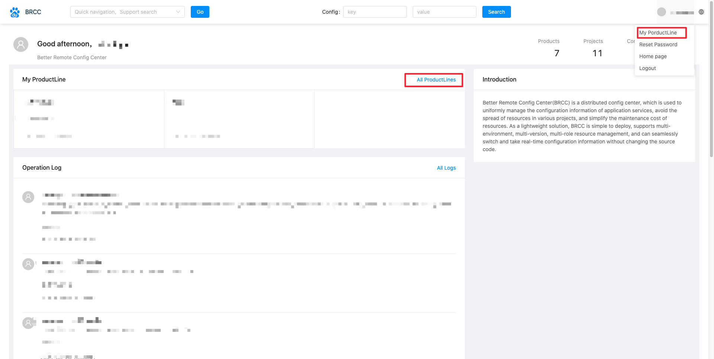

- [Quick Start](#quick-start)
  - [Deploy BRCC](#deploy-brcc)
  - [Add Configuration](#add-configuration)
    - [Login](#login)
    - [Add Product](#add-product)
    - [Add Project](#add-project)
    - [Add Environment](#add-environment)
    - [Add Version](#add-version)
    - [Add Group](#add-group)
    - [Add Configuration](#add-configuration-1)
  - [JAVA-SDK](#java-sdk)
    - [Add BRCC Dependency](#add-brcc-dependency)
    - [Add BRCC Configuration](#add-brcc-configuration)
    - [Check Configuration](#check-configuration)
    - [Use Configuration](#use-configuration)
  - [Go-SDK](#go-sdk)
    - [BRCC-Go-SDK URL](#brcc-go-sdk-url)
    - [BRCC Initialization](#brcc-initialization)
      - [1) Initialize BRCC client by toml file](#1-initialize-brcc-client-by-toml-file)
      - [2) Initialize BRCC Client](#2-initialize-brcc-client)
    - [BRCC Get Configuration](#brcc-get-configuration)
    - [BRCC Injection](#brcc-injection)
    - [BRCC Configuration Change Monitoring](#brcc-configuration-change-monitoring)

## Quick Start
### Deploy BRCC
&ensp;&ensp;&ensp;&ensp;Please click <[Deploy Guide](./deploy-guide.md)> to see how to deploy BRCC server. Assume that the server URL is http://127.0.0.1:8080
### Add Configuration
#### Login
http://127.0.0.1:8080/#/login


- *\*Administrator account: admin password: admin*

#### Add Product
&ensp;&ensp;&ensp;&ensp;Product line entrance: Home Page[All ProductLines], [My ProductLine] in personal information menu



Add Product: test


Click 'test' to enter the project
#### Add Project
&ensp;&ensp;&ensp;&ensp;

Click 'Create Project' to add a new project 'example', set the API password. Click 'example' to enter the project.
#### Add Environment
Click 'Create Environment' to add a new environment 'dev'.

Click 'dev' to enter the environment.
#### Add Version
Click 'Create Version': 1.0, click "1.0" to enter the version. 

#### Add Group
Click 'Create Group' to add a new group 'g1', click 'g1' to enter the group.

#### Add Configuration
Add Configuration：
```
a=5
b=34
c=xx13
```

### JAVA-SDK
#### Add BRCC Dependency
Create a springboot application and add the following dependencies to the pom file:
```xml
<dependency>
    <groupId>com.baidu.mapp</groupId>
    <artifactId>brcc-sdk-starter</artifactId>
    <version>1.0.0</version>
</dependency>
```
Please use the latest brcc sdk starter version[](https://maven-badges.herokuapp.com/maven-central/com.baidu.mapp/brcc-sdk-starter)
#### Add BRCC Configuration
Add BRCC configuration in application.yml
```yaml
rcc:
  cc-server-url: http://127.0.0.1:8080/ #BRCC server URL
  project-name: example                 #project name
  cc-password: 123456                   #project api password
  env-name: dev                         #environment name
  cc-version-name: 1.0                  #version name
  log-properties: true                  #enable print configuration
  enable-update-callback: true          #enable automatic updates
  enable-interrupt-service: true        #whether to interrupt the service when API password is incorrect for the first loading
```
#### Check Configuration
Start the application and check the log:
```
a=5
b=34 
c=xx13 
```
#### Use Configuration
You can use configurations by spring annotation after pulling them, for example:
```java
@Value("${a}")
int a = 0;

@Value("${b}")
long b = 0;

@Value("${c}")
String c;
```

### Go-SDK
#### BRCC-Go-SDK URL
https://github.com/baidu/brcc/tree/main/brcc-go-sdk
#### BRCC Initialization
```go
import (
    brcc github.com/baidu/brcc/brcc-go-sdk
)
```
##### 1) Initialize BRCC client by toml file
Example
```toml
serverUrl = "brcc.baidu-int.com"
projectName = "brcc-go-client"
envName = "debug"
versionName = "1.0"
apiPassword = "123456"
enableCallback = true
callbackInterval = 300
requestTimeout = 5
enableCache = true
cacheDir = "/tmp/brcc"
```
Parameter Description
| Configuration parameter | Type | Required | Description                                                     |
| ---------------- | ------ | -------- | ------------------------------------------------------------ |
| serverUrl        | string | YES       | BRCC server URL                                                 |
| projectName      | string | YES       | project name                                                   |
| envName          | string | YES       | environment name                                                   |
| versionName      | string | YES       | version name                                                       |
| apiPassword      | string | YES       | API password                                                  |
| enableCallback   | bool   | NO       | enable callback, default: false                        |
| callbackInterval | int    | NO       | call back interval time(s), default: 300s                    |
| requestTimeout   | int    | NO       | brcc service access timeout time(s), default: 5s                  |
| enableCache      | bool   | NO       | enable file cache, default: false |
| cacheDir         | string | NO       | File cache path, default: /tmp/brcc                               |
Initialization
```go
// Initialize the BRCC Client with toml file
err := brcc.StartWithConfFile(name)
if err != nil {
	panic(fmt.Sprintf("init brcc error: %v", err.Error()))
}
```
##### 2) Initialize BRCC Client
Example
```go
brccConf := &brcc.Conf{
    ProjectName:         "brcc-go-client",
    EnvName:             "debug",
    ServerUrl:           "brcc.baidu-int.com",
    ApiPassword:         "123456",
    VersionName:         "1.0",
    EnableCallback:      true,
    CallbackIntervalInt: 300,
    RequestTimeoutInt:   5,
    EnableCache:         true,
    CacheDir:            "/tmp/brcc",
}

err := brcc.StartWithConf(ctx, brccConf)
if err != nil {
    panic(fmt.Sprintf("init brcc error: %v", err.Error()))
}
```
#### BRCC Get Configuration
```go
// get value
brcc.GetValue(key, defaultValue)
// get key
brcc.GetAllKeys()
```
#### BRCC Injection
```go
type Test struct {
    A bool   `brcc:"test.a"`
    B int    `brcc:"test.b"`
    C string `brcc:"test.c"`
}

tv := &Test{}
// Injection
brcc.Bind(tv)
```
#### BRCC Configuration Change Monitoring
Example
```go
type DemoSet struct {
    data map[string]string
}

func (d *DemoSet) Update(ce *brcc.ChangeEvent) {
    defer func() {
        if r := recover(); r != nil {
            fmt.Println("watch update callback panic")
        }
    }()
    for key, change := range ce.Changes {
        if change.ChangeType == brcc.ADD || change.ChangeType == brcc.MODIFY {
            d.data[key] = change.NewValue
        }
        if change.ChangeType == brcc.DELETE {
            delete(d.data, key)
        }
    }
}

d = DemoSet{data: map[string]string{}}
brcc.Watch(d.Update)
```
